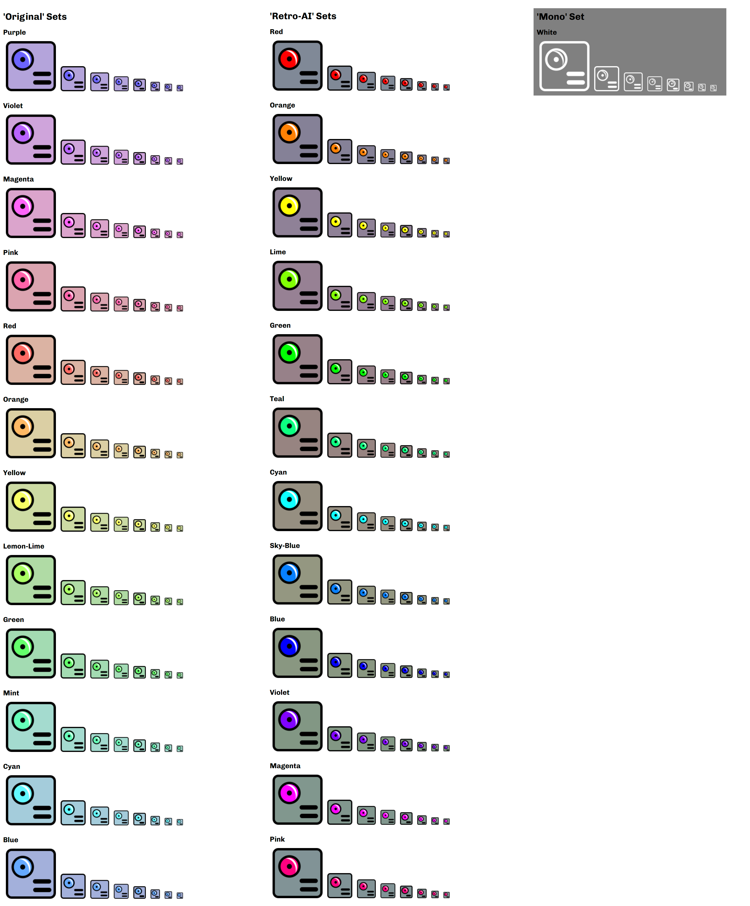

# AI Extension Icons

A collection of PNG icons for AI-affiliated applications, featuring three variant sets: Original, Retro-AI, and Mono. Designed for use in browser extensions, web apps, and UI projects.

## Variants

- **Original Sets**: 12 color variants with hue-rotated lens and matching background. Colors: purple (base), violet (+30°), magenta (+60°), pink (+90°), red (+120°), orange (+150°), yellow (+180°), lemon-lime (+210°), green (+240°), mint (+270°), cyan (+300°), blue (+330°).
- **Retro-AI Sets**: 12 color variants with hue-rotated lens and gunmetal background. Colors: red (base), orange (+30°), yellow (+60°), lime (+90°), green (+120°), teal (+150°), cyan (+180°), sky-blue (+210°), blue (+240°), violet (+270°), magenta (+300°), pink (+330°).
- **Mono Set**: Single white variant with transparent background for versatile use.

## Sizes

Each variant is available in 8 sizes: 16px, 19px, 24px, 32px, 38px, 48px, 64px, 128px.

## Structure

Icons are organized by variant, color, and size:
- `original/[color]/iconXX.png` (e.g., `original/red/icon16.png`)
- `retro-ai/[color]/iconXX.png` (e.g., `retro-ai/teal/icon64.png`)
- `mono/white/iconXX.png` (e.g., `mono/white/icon128.png`)

## Preview

## License

Distributed under the MIT License. See [LICENSE](LICENSE) for details.

## Usage

Ideal for AI-themed browser extensions, web applications, or UI designs. Icons are optimized for clarity at various sizes, with Mono’s transparency suited for diverse backgrounds.